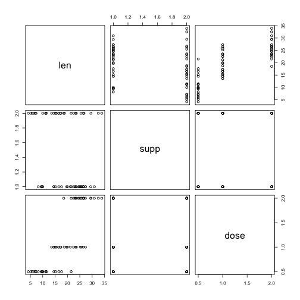
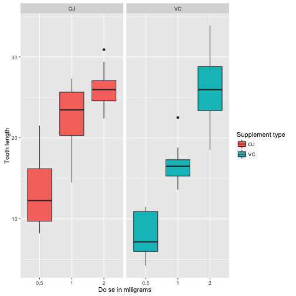

R presentation practice
========================================================
author: Mei Chiao Lin
date: January, 20, 2016

R Presentation and Shiny practice
========================================================
The practices performed in the presentation:

**1. Use shiny to create interactive plot to show distribution plot with R datasets, please see the demo on the link:**
https://meiclin.shinyapps.io/Dev_project/

**2. R Code Practice on R Presentation**

**3. R Chart Practice on R Presentation with scatter plot**

**4. Cooleration Plot Practice with ggplot on R Presentation**

Actually, I tried Slidify and still work on putting shinyapp on Slidify

R Code Practice
========================================================
Show the first 6 and last 6 data of ToothGrowth dataset 

```
   len supp dose
1  4.2   VC  0.5
2 11.5   VC  0.5
3  7.3   VC  0.5
4  5.8   VC  0.5
5  6.4   VC  0.5
6 10.0   VC  0.5
```

```
    len supp dose
55 24.8   OJ    2
56 30.9   OJ    2
57 26.4   OJ    2
58 27.3   OJ    2
59 29.4   OJ    2
60 23.0   OJ    2
```

R Chart Practice
========================================================
Scatter plot practice with ToothGrowth dataset


Correlation Plot Practice
========================================================
**To see the effect of supplements on tooth length with ToothGrowth dataset by ggplot.
The result shows the tooth length has positive correlation with the dosage of VC and OJ supplements.**


